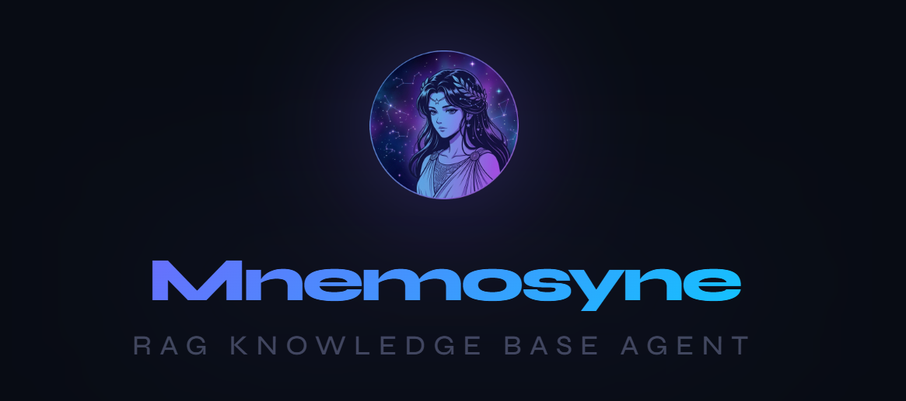
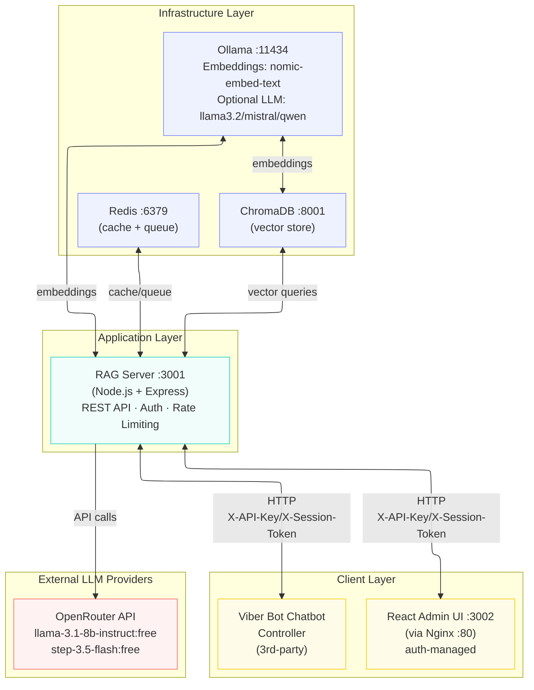

# Mnemosyne — RAG Knowledge Base Agent



A self-hosted, containerized Retrieval-Augmented Generation (RAG) system with full authentication, live LLM switching, and REST API for third-party chat integrations. Answers questions grounded exclusively in your own uploaded documents.

---

## Table of Contents

- [Architecture](#architecture)
- [Component Stack](#component-stack)
- [Authentication](#authentication)
- [Guardrails](#guardrails)
- [Quick Start](#quick-start)
- [OCR Support (Images & Scanned PDFs)](#ocr-support-images--scanned-pdfs)
- [Connect a Third-Party Chat Integration](#connect-a-third-party-chat-integration)
- [Live LLM Switching](#live-llm-switching)
- [REST API Reference](#rest-api-reference)
- [Configuration Reference](#configuration-reference)
- [Smart Rate Limiting](#smart-rate-limiting)
- [Troubleshooting](#troubleshooting)
- [Docker Container Reference](#docker-container-reference)
- [License](#license)

---

## Architecture



### Component Stack

| Component | Technology | Role |
|-----------|------------|------|
| **LLM (Generation)** | [OpenRouter](#openrouter) (cloud) *or* [Ollama](#ollama) (local) | Response generation — free tier cloud models or local models via Ollama |
| **Embeddings** | [Ollama](#ollama) + `nomic-embed-text` | Local semantic indexing — ~270 MB, no API cost |
| **Vector DB** | [ChromaDB](https://www.trychroma.com/) | Chunk storage and cosine similarity search |
| **Cache / Queue** | [Redis](https://redis.io/) + Bull | Query caching, async job queue |
| **API Server** | Node.js + Express | REST API, auth, rate limiting |
| **Admin UI** | React | Document management, query testing, live model switching, guardrails, and API key management |

---

## Authentication

### API Key — Server-to-Server

- Static secret, minimum 32 characters
- Set via `RAG_API_KEY` in `.env`
- Also set in 3rd-party chat integration as an environment variable
- Grants access to `/api/query` and `/api/query/status/:jobId`

### Session Token — React UI

- Login via `POST /api/auth/login` → receive a 64-char hex token
- Valid for `SESSION_TTL_HOURS` (default 8 h), stored in `sessionStorage`
- Token verified automatically on every page load
- 5 failed login attempts → IP locked out for 15 minutes

### Public Endpoints (No Auth Required)

- `GET /health`
- `POST /api/auth/login`

---

## Guardrails

Mnemosyne includes configurable security features designed for data-privacy compliance and to prevent jailbreak attacks. These guardrails can be toggled in the **Guardrails** tab of the Admin UI or configured via environment variables.

### Security Features

- **Input Validation**: Validates user queries to prevent malicious or inappropriate content
- **Prompt Hardening**: Strengthens prompts to reduce susceptibility to prompt injection attacks
- **Output Filtering**: Filters generated responses to remove sensitive or harmful content
- **Enhanced Logging**: Provides detailed logging for security monitoring and compliance
- **Document Sensitivity**: Applies additional checks on uploaded documents for sensitive information

### Configuration

```env
# Security features for data-privacy compliance and jailbreak prevention
# Set to 'false' to disable, default is 'true'
ENABLE_INPUT_VALIDATION=true
ENABLE_PROMPT_HARDENING=true
ENABLE_OUTPUT_FILTERING=true
ENABLE_ENHANCED_LOGGING=true
ENABLE_DOCUMENT_SENSITIVITY=true
```

All guardrails are enabled by default.

---

## Quick Start

### Prerequisites

- Docker Engine 24+ and Docker Compose v2+
- 6 GB RAM minimum
- A free [OpenRouter](https://openrouter.ai) API key **or** local [Ollama](https://ollama.ai/) setup

### 1 — Configure Secrets

```bash
cp .env.example .env
```

Open `.env` and fill in:

```env
# Generate: openssl rand -hex 32
RAG_API_KEY=your_64_char_hex_key

ADMIN_USERNAME=admin
ADMIN_PASSWORD=your_strong_password

# Free at https://openrouter.ai → Keys → Create Key
OPENROUTER_API_KEY=sk-or-v1-xxxxxxxxxxxxxxxx
```

### 2 — Start the Stack

```bash
docker compose up -d

# First boot: Ollama pulls nomic-embed-text (~270 MB)
docker logs mnemosyne-ollama -f
```

### 2a — Rebuilding After Code Changes

Mnemosyne uses Docker named volumes for all persistent data (ChromaDB embeddings, Redis config/queue, uploaded documents). **Do not run `docker compose down`** before rebuilding — that detaches and may delete volumes, causing data loss.

```bash
# SAFE: rebuild only rag-server (and rag-ui if needed), volumes untouched
docker compose up --build --force-recreate rag-server rag-ui

# If only the server changed:
docker compose up --build --force-recreate rag-server
```

If you **must** run a full `docker compose down` (e.g. to change `.env` values), use the backup guard first:

```bash
bash scripts/backup-before-rebuild.sh
```

See `scripts/backup-chromadb.sh` for full backup/restore commands.

### 3 — Open the Admin UI

**http://localhost:3002** → login with your `ADMIN_USERNAME` / `ADMIN_PASSWORD`

The Admin UI provides tabs for Knowledge Base management, Query testing, System Status monitoring, API Keys, Guardrails configuration, and general Settings.

### 4 — Upload Documents

Go to the **Knowledge Base** tab and upload PDFs, Excel files, Markdown, DOCX, CSV, plain text, or images. Each document is parsed, chunked, embedded, and indexed automatically. A live progress bar shows the exact stage.

---

## OCR Support (Images & Scanned PDFs)

Mnemosyne automatically extracts text from images and scanned PDFs using Tesseract OCR:

- **Supported image formats**: PNG, JPG, JPEG, GIF, BMP, TIFF, TIF
- **PDF processing**: If direct text extraction yields <10 characters, OCR runs automatically as fallback
- **Language**: English (default), configurable via `OCR_LANG`

OCR is enabled by default. To disable or configure:

```env
OCR_ENABLED=false        # Set to false to disable OCR
OCR_MIN_TEXT_LENGTH=10   # Minimum text for successful extraction
OCR_LANG=eng             # Tesseract language code
```

---

## Connect a Third-Party Chat Integration

Use the API key for third-party integrations:

```env
# In your chat integration
RAG_SERVER_URL=http://localhost:3001
RAG_API_KEY=your_64_char_hex_key  # same key as .env
```

Verify the connection:

```bash
curl http://localhost:3001/api/info \
  -H "X-API-Key: your_api_key"
```

Expected response includes `ollama`, `chromadb`, `redis` status.

---

## Live LLM Switching

You can switch the active language model **at runtime without restarting** any container.

### LLM Engine Selection

Mnemosyne supports two LLM engines:

- **[OpenRouter](#openrouter)** (cloud): Uses OpenRouter's API for generation. Set `OPENROUTER_API_KEY` in `.env` (free tier available, no credits needed).
- **Local Ollama**: Runs LLMs locally in the Ollama container. No API key needed.

Choose the engine in the **Settings** tab (Model & RAG Settings → LLM Engine dropdown):

| Engine | Behavior |
|--------|----------|
| **Auto** (default) | Uses OpenRouter if API key is present, otherwise Local Ollama |
| **openrouter** | Always use OpenRouter cloud API |
| **local** | Always use local Ollama models |

Set the default local model via `LOCAL_LLM_MODEL` in `.env` (default: `llama3.2`). Available models can be pulled with `ollama pull <model>` inside the Ollama container.

### Switching Models (OpenRouter)

#### Via the Admin UI

Go to **System Status** → **Language Model** → select from configured OpenRouter models.

#### Via API

```bash
# List available free models
curl http://localhost:3001/api/models \
  -H "X-Session-Token: your_token"

# Switch to a different model
curl -X POST http://localhost:3001/api/models/switch \
  -H "Content-Type: application/json" \
  -H "X-Session-Token: your_token" \
  -d '{"modelId": "meta-llama/llama-3.1-8b-instruct:free"}'
```

#### Via Environment Variable (OpenRouter)

To make an OpenRouter model switch permanent, update `OPENROUTER_MODEL` in `.env` and restart the container.

For local Ollama models, set `LOCAL_LLM_MODEL` in `.env` (e.g., `llama3.2`, `mistral`, `qwen2.5`) and optionally set `LLM_ENGINE=local` to force local mode.

---

## REST API Reference

Interactive API documentation is available at `http://localhost:3001/docs` (requires session token for authentication in the UI).

All endpoints require auth except `/health` and `POST /api/auth/login`.

### Auth

```bash
# Login
curl -X POST http://localhost:3001/api/auth/login \
  -H "Content-Type: application/json" \
  -d '{"username":"admin","password":"yourpassword"}'
# → { "token": "abc123...", "expiresAt": "..." }

# Verify
curl http://localhost:3001/api/auth/verify \
  -H "X-Session-Token: abc123..."
```

### Query

```bash
# Sync query — API Key
curl -X POST http://localhost:3001/api/query \
  -H "Content-Type: application/json" \
  -H "X-API-Key: your_api_key" \
  -d '{"query": "What information is in the knowledge base?"}'

# Async query — enqueue and poll
curl -X POST http://localhost:3001/api/query \
  -H "X-Session-Token: your_token" \
  -H "Content-Type: application/json" \
  -d '{"query": "Summarise the uploaded documents", "async": true}'
# → { "jobId": "42" }

curl http://localhost:3001/api/query/status/42 \
  -H "X-Session-Token: your_token"

# Debug — see raw similarity scores for a query
curl "http://localhost:3001/api/query/debug?q=your+question" \
  -H "X-Session-Token: your_token"
```

### Documents

```bash
# Upload (supports PDF, DOCX, XLSX, CSV, MD, TXT, PNG, JPG, JPEG, GIF, BMP, TIFF, TIF)
curl -X POST http://localhost:3001/api/documents/upload \
  -H "X-Session-Token: your_token" \
  -F "file=@/path/to/document.pdf"

# Upload with tags
curl -X POST http://localhost:3001/api/documents/upload \
  -H "X-Session-Token: your_token" \
  -F "file=@/path/to/document.pdf" \
  -F "tags=finance,quarterly"

# List (optionally filter by tags)
curl http://localhost:3001/api/documents \
  -H "X-Session-Token: your_token"

# List documents with specific tags
curl "http://localhost:3001/api/documents?tags=finance,quarterly" \
  -H "X-Session-Token: your_token"

# Check ingest job progress
curl http://localhost:3001/api/documents/ingest-status/<jobId> \
  -H "X-Session-Token: your_token"

# Delete
curl -X DELETE http://localhost:3001/api/documents/<id> \
  -H "X-Session-Token: your_token"

# Update document tags
curl -X PUT http://localhost:3001/api/documents/<id>/tags \
  -H "Content-Type: application/json" \
  -H "X-Session-Token: your_token" \
  -d '{"tags":["new","tags"]}'
```

### Models

```bash
# List available models
curl http://localhost:3001/api/models \
  -H "X-Session-Token: your_token"

# Switch active model live
curl -X POST http://localhost:3001/api/models/switch \
  -H "Content-Type: application/json" \
  -H "X-Session-Token: your_token" \
  -d '{"modelId":"meta-llama/llama-3.1-8b-instruct:free"}'
```

### Analytics

```bash
# Overview — system metrics at a glance
curl http://localhost:3001/api/analytics/overview \
  -H "X-Session-Token: your_token"

# Tag statistics and co-occurrences
curl http://localhost:3001/api/analytics/tags \
  -H "X-Session-Token: your_token"

# Session analytics with daily breakdown
curl http://localhost:3001/api/analytics/sessions \
  -H "X-Session-Token: your_token"

# Token usage, cache stats, and queue metrics
curl http://localhost:3001/api/analytics/usage \
  -H "X-Session-Token: your_token"
```

### Sessions

```bash
# List all conversation sessions
curl http://localhost:3001/api/sessions \
  -H "X-Session-Token: your_token"

# Get session messages
curl http://localhost:3001/api/sessions/<sessionId> \
  -H "X-Session-Token: your_token"

# Add message to session
curl -X POST http://localhost:3001/api/sessions/<sessionId>/messages \
  -H "Content-Type: application/json" \
  -H "X-Session-Token: your_token" \
  -d '{"type":"assistant","text":"Hello! How can I help?","fromCache":false}'
```

### Admin

```bash
# Full diagnostics (OpenRouter, Ollama, ChromaDB, Redis)
curl http://localhost:3001/api/diagnostics \
  -H "X-Session-Token: your_token"

# Clear query cache
curl -X DELETE http://localhost:3001/api/cache \
  -H "X-Session-Token: your_token"

# Reset vector store (wipes all chunks — re-upload required)
curl -X POST http://localhost:3001/api/vector-store/reset \
  -H "X-Session-Token: your_token"
```

---

## Configuration Reference

| Variable | Default | Description |
|----------|---------|-------------|
| `RAG_API_KEY` | — | **Required.** Min 32 chars. `openssl rand -hex 32` |
| `ADMIN_USERNAME` | `admin` | UI login username |
| `ADMIN_PASSWORD` | — | **Required.** Min 8 chars |
| `SESSION_TTL_HOURS` | `8` | UI session lifetime (hours) |
| `OPENROUTER_API_KEY` | — | **Required for OpenRouter.** Free at [openrouter.ai](https://openrouter.ai) |
| `OPENROUTER_MODEL` | `stepfun/step-3.5-flash:free` | Default LLM (switchable live) |
| `LOCAL_LLM_MODEL` | `llama3.2` | Default local Ollama model |
| `LLM_ENGINE` | *(auto)* | `openrouter`, `local`, or empty for auto-detect |
| `OLLAMA_HOST` | `http://ollama:11434` | Ollama endpoint (embeddings + local LLM) |
| `EMBED_MODEL` | `nomic-embed-text` | Embedding model |
| `TOP_K` | `5` | Chunks retrieved per query |
| `MIN_RELEVANCE_SCORE` | `0.15` | Cosine similarity threshold (0–1) |
| `CHUNK_SIZE` | `500` | Words per document chunk |
| `CHUNK_OVERLAP` | `50` | Overlap between adjacent chunks |
| `CACHE_TTL` | `3600` | Query cache TTL in seconds |
| `CORS_ORIGIN` | `*` | Restrict in production |
| `APP_URL` | `http://localhost:3002` | Application start URL |
| `OCR_ENABLED` | `true` | Enable OCR for scanned PDFs and images |
| `OCR_MIN_TEXT_LENGTH` | `10` | Minimum text length for OCR success |
| `OCR_LANG` | `eng` | Tesseract OCR language code |

---

## Smart Rate Limiting

Mnemosyne implements **intelligent, endpoint-specific rate limiting** to prevent bottlenecks during high-traffic operations while protecting the server from abuse.

### Rate Limit Tiers

| Endpoint Type | Limit | Window | Purpose |
|---------------|-------|--------|---------|
| **Login** | 10 attempts | 15 minutes | Brute-force protection |
| **Query operations** | 150 req/min[*](#) | 1 minute | Document queries + job status polls |
| **Status & Health** | 300 req/min[*](#) | 1 minute | Live metric polling (1–5 sec intervals) |
| **Document upload** | 10 uploads | 1 minute | Document ingestion |
| **Unauthenticated** | 50% lower | — | API key/session exempt |

> **[*]** Authenticated users (with `X-Session-Token` or `X-API-Key` header) receive higher limits.

### How It Works

- **Login Brute-Force Protection**: 10 failed attempts per 15 minutes per IP. Returns `429` after 10 failures.
- **High-Throughput Queries**: Supports 150 requests/minute (~2.5 req/sec) for authenticated users. Handles simultaneous uploads with 3-second polling intervals.
- **Live Status Polling**: Status/health checks get 300 req/min. Enables 1-second queue metric polling and 5-second health checks.
- **Intelligent Backoff**: Clients hitting the rate limit auto-backoff exponentially (1.5× → 2.25× → 3.375×) to prevent retry storms.

### Configuration

```env
# Default: 120 (≈2 req/sec for auth users)
# Example: 240 = 4 req/sec, 60 = 1 req/sec
RATE_LIMIT_MAX=120
```

### Monitoring Rate Limits

When a rate limit is exceeded:

```json
{
  "error": "Too many requests. Please try again in a moment.",
  "retryAfter": 60
}
```

The UI shows a toast notification. Operations retry automatically with exponential backoff.

---

## Troubleshooting

**Document uploads succeed but queries return "no information"**

Run the debug endpoint to see actual similarity scores:

```bash
curl "http://localhost:3001/api/query/debug?q=your+question" -H "X-Session-Token: your_token"
```

If all scores are below `MIN_RELEVANCE_SCORE`, lower the threshold. If no chunks are returned at all, reset the vector store collection and re-upload — the collection may have been created with the wrong distance metric.

**Document shows "Processing…" then disappears**

Check server logs:

```bash
docker logs mnemosyne-rag-server --tail 80
```

Most common cause is Ollama not responding. Verify:

```bash
docker logs mnemosyne-ollama --tail 30
```

**OpenRouter returns 429**

Free tier has rate limits. Wait 30–60 seconds and retry, or switch to a less busy free model via the System Status tab.

**Container name conflicts on startup**

If you previously ran the stack with old `avabas-*` container names, remove them first:

```bash
docker rm -f avabas-ollama avabas-chromadb avabas-redis avabas-rag-server avabas-rag-ui 2>/dev/null
docker compose up -d
```

---

## Docker Container Reference

| Container | Image | Ports | Purpose |
|-----------|-------|-------|---------|
| `mnemosyne-ollama` | `ollama/ollama:0.3.12` | `127.0.0.1:11435:11434` | Embedding + optional local LLM runtime |
| `mnemosyne-ollama-init` | `curlimages/curl` | *(one-shot)* | Pulls `nomic-embed-text` on first boot, then exits |
| `mnemosyne-chromadb` | `chromadb/chroma:latest` | `127.0.0.1:8001:8000` | Vector database |
| `mnemosyne-redis` | `redis:7-alpine` | `127.0.0.1:6380:6379` | Cache + job queue |
| `mnemosyne-rag-server` | Built from `rag-server/` | `3001:3001` | REST API |
| `mnemosyne-rag-ui` | Built from `rag-ui/` | `3002:80` | React Admin UI |

---

## OpenRouter

[OpenRouter](https://openrouter.ai) is the cloud LLM provider used by Mnemosyne for response generation. It offers a free tier with no credits required for qualifying models.

- **Sign up:** https://openrouter.ai
- **API keys:** https://openrouter.ai/keys
- **Free models available:** `meta-llama/llama-3.1-8b-instruct:free`, `stepfun/step-3.5-flash:free`, and more
- **Paid models:** Add credits for access to premium models (GPT-4o, Claude, etc.)
- **No credits needed for free tier** — get started immediately with a free account

Configuration:

```env
OPENROUTER_API_KEY=sk-or-v1-yourkeyhere        # Required (or leave empty to use local Ollama only)
OPENROUTER_MODEL=stepfun/step-3.5-flash:free   # Default model
```

---

## Ollama

[Ollama](https://ollama.ai/) is used locally for two purposes:

1. **Embeddings** — `nomic-embed-text` (~270 MB) runs persistently and powers all semantic search
2. **Optional local LLM** — Run models like `llama3.2`, `mistral`, or `qwen2.5` entirely on your hardware

### Running in Docker

Mnemosyne ships with Ollama pinned to `ollama/ollama:0.3.12` to avoid a known CUDA layer bug on Windows. The container:

- Runs `nomic-embed-text` automatically on first boot
- Exposes port `11434` on the Docker network (not host)
- Keeps models in the `ollama_data` Docker volume

### Running Locally (Alternative)

If you prefer to run Ollama on your host instead of Docker:

```env
# In .env — point to your local Ollama instance
OLLAMA_HOST=http://host.docker.internal:11434
```

> **Note:** `host.docker.internal` resolves to the host machine from inside Docker containers.

### Available Local LLM Models

Pull a model directly into the running Ollama container:

```bash
docker exec -it mnemosyne-ollama ollama pull llama3.2
docker exec -it mnemosyne-ollama ollama pull mistral
docker exec -it mnemosyne-ollama ollama pull qwen2.5

# List installed models
docker exec mnemosyne-ollama ollama list
```

### Switching to Local-Only Mode

Set these in `.env` to use Ollama for both embeddings and generation (OpenRouter not required):

```env
LLM_ENGINE=local
LOCAL_LLM_MODEL=llama3.2
# Omit OPENROUTER_API_KEY
```
